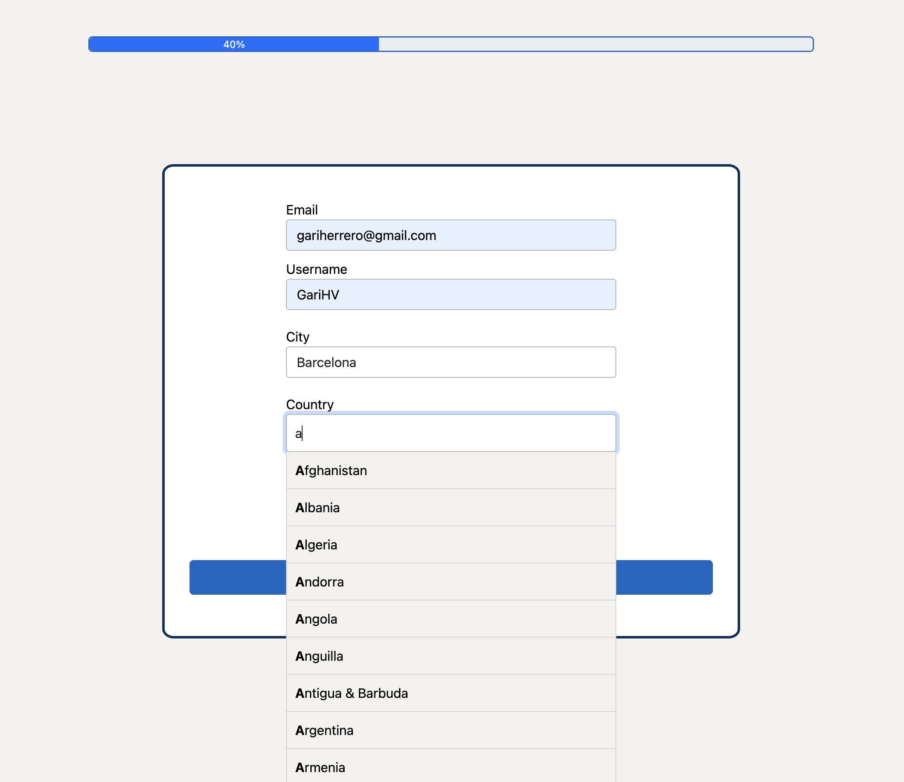

# GariHV - Frontend proposal // 4YFN - MWC Barcelona 2022

## Index

-[Introduction](#introduction).
-[Getting Started](#getting-started)
  -[Prerequisites](#prerequisites)
-[Extras explanation](#extras-explanation)
  -[Autocomplete function](#autocomplete-function)
  -[Getting Started](#getting-started)
  -[Getting Started](#getting-started)
  -[Getting Started](#getting-started)
-[Getting Started](#getting-started)
-[Getting Started](#getting-started)
-[Getting Started](#getting-started)

## Introduction

At 4YFN – MWC Barcelona 2022, the organization told us to work as the Barcelona Digital Talent has hired us to develop their website. We could use the technology which we thought is the most convenient as long as we followed this points:

- Task 1 → Form that allows to enter the following data: email, full name, brief description, country and city of residence.

- Task 2 → Generate a random avatar of the person (it can be using an API, colors, etc).

- Task 3 → Form that allows to enter professional data: years of experience, sector (Front, Back, Mobile or Data), skills: (can be added freely).

- Task 4 → The skills are tagged somewhere in the profile.

- Task 5 → A view that allows to see the whole user profile with the above data.

## Getting Started

These instructions will get you a copy of the project up and running on your local machine for development and testing purposes. See deployment for notes on how to deploy the project on a live system.

### Prerequisites

If you want to use this application and customize it you will need to install:

- Node.js
```
https://nodejs.org/es/download/
```

- Sass:
```
npm install -g sass
```

All the customize features are implemented with Sass. Taking that into account, you will need to understand how to compile the Sass code into Css.

If you use the main structure implemented in this repository, just introduce the following code in the Terminal:

```
sass --watch assets/scss/index.scss:assets/css/index.css
```

## Extras explanation

### Autocomplete function

These instructions will get you a copy of the project up and running on your local machine for development and testing purposes. See deployment for notes on how to deploy the project on a live system.

### LocalStorage

### Technologies display


### Technologies display


## Deployment

Use this URL to use the application: https://fervent-torvalds-3b6c3f.netlify.app/

## Built With

* [JavaScript](https://www.javascript.com/) - The main technology used to create the web's interactions.
* [Sass](https://sass-lang.com/) - Technology used as a stylesheet language that’s compiled to CSS.
* [HTML5](https://developer.mozilla.org/es/docs/Glossary/HTML5) - Used as the web's structure.

## Authors

* **Garikoitz Herrero Vargas** - [GariHV](https://github.com/GariHV)

## Screenshots

- Screenshot of the first form showing the display of the autocomplete function.



- Screenshot of the second form showing the display of the autocomplete function.


- Screenshot of the second form showing the display of the technologies selected displayed.


- Screenshot of the User-Info view showing the display of the information introduced by the user in the first form.


- Screenshot of the User-Info view showing the display of the information introduced by the user in the second form.

Here you can see how the input saved as "stacks" in the localStorage is displayed showing its own icon and tag. 


